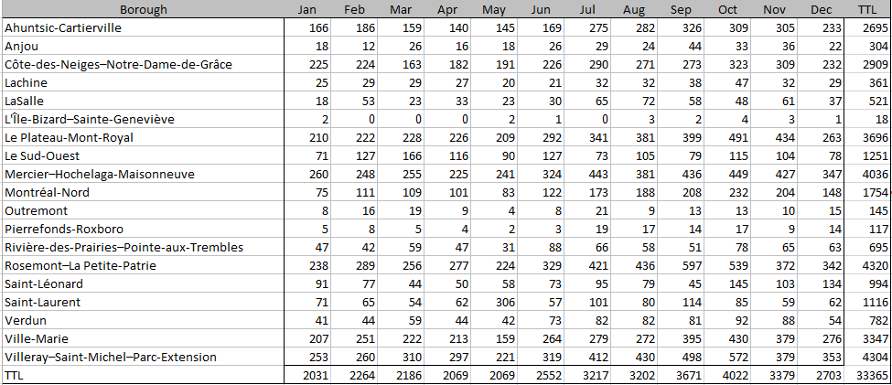
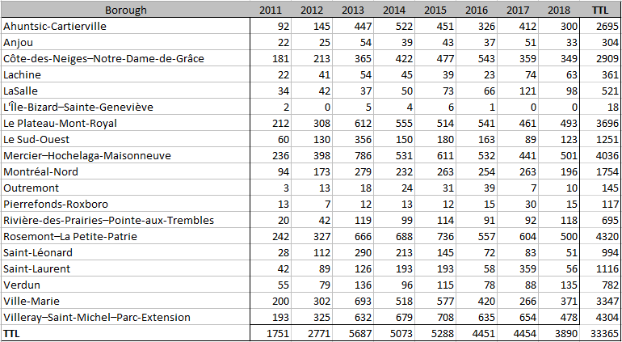
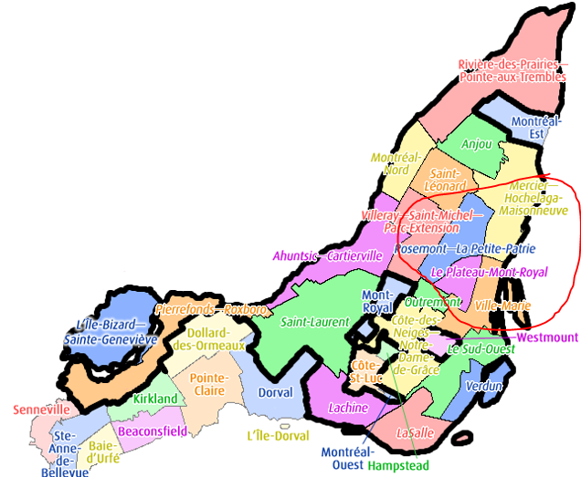

# Deadline: May 11th - Data Blog

##Descriptive

 

The data chart above gives us a glimpse into the breakdown of declarations made through the city since they began tracking this information in July 2011.  We can see that the top 5 months for declarations are between the periods of July and November.  During this part of the year, there were over 3000 declarations registered per month.  After a peak in the month of October of 4022, it declines by 16% in November to 3379 and from October to December we see a decrease of 33%.  The largest decrease can be found between the months of October and January at 50.5%.  
The lowest number of cases can be found between the period of December to May with January, April and May totaling the least.  After a low in May, we can see a surge going into the summer period with increases between May to June and June to July of 23% and 26% respectively giving us an augmentation of reported cases from May to July of 55.5%.

The chart above identifies the declarations by borough on a yearly basis.  We can see based on the figures that the boroughs of Rosemont-La Petite Patrie, Villeray-Saint-Michel-Parc-Extension, Mercier-Hochelaga-Maisonneuve, Le Plateau Mont-Royal and Ville-Marie account for 4320, 4304, 4036, 3696 and 3347 respectively.  These 5 boroughs out of the reported 19 account for 59% of the declared infestations over the period 2011-2018 and led the way with declarations in 2018.  The largest increase in number of declarations based on volume for 2018 are Verdun (53%), Ville-Marie (39.5%), Sud-Ouest (38%) and Rivière-des-Prairies–Pointe-aux-Trembles (28%) and Mercier-Hochelaga-Maisonneuve (13.6%).  The remaining are very low volumes or a decrease from the previous year.  A borough to gather more insight on would be Saint-Laurent.  We see during the last 3 years a decline of 70%, increase of 518% and decline of 84%.

As you can see above, the top 5 boroughs, in terms of reported declarations share the same borders.

##Diagnostics

The data encompasses all official declarations made to the city associated to an extermination.  As specified on the city dataset site, any declaration that is not associated to an extermination has been removed from the dataset.  Those entries account for 7% of the declarations and would translate to approximately 2335 declarations.  There is no guarantee that all infestations have been reported so the possibility exists that, besides the ones removed, the number can be higher.  

As we have seen with the monthly breakdown chart the volume of reported case are higher between June and November.  What can be some causes?  Better weather gets more people out, interacting and moving around enabling bedbugs to have more carriers to allow them to move around from place to place.  This period also coincides with moving season in which people rid themselves of unwanted furniture which can make their way back into another home.  Based on government documentation 2 of the methods for removal of bedbugs are through heat or cold treatments.  Heat above 48 degrees and cold below 18 degrees Celsius.  The 18 degrees below Celsius is a great indicator of why the declarations are reduced during the winter period.  As they would not survive outdoors they are restricted to remaining indoors curtailing the spread during this period.

1* (http://www.environnement.gouv.qc.ca/pesticides/permis-en/code-gestion-en/BedBugControl.pdf)

2* (http://donnees.ville.montreal.qc.ca/dataset/declarations-exterminations-punaises-de-lit)

3* (https://en.wikipedia.org/wiki/Boroughs_of_Montreal)
